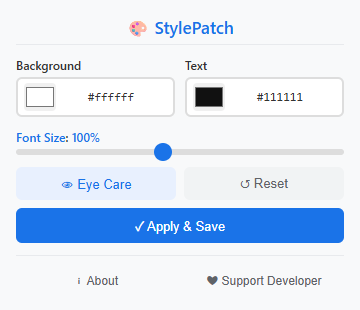

# StylePatch

[English](README.md) | [中文](README_zh.md) | [Español](README_es.md) | [Deutsch](README_de.md) | [日本語](README_ja.md) | [Français](README_fr.md)

A lightweight browser extension that lets you customize any webpage's background color, text color, and font size instantly.

> Chromium-based · Manifest V3 · Zero tracking · Per-site settings

---

## Features

| Feature | Description |
|---------|-------------|
| 🎨 **Background & Text Color** | Pick any color via native color picker or type hex code directly |
| 🔠 **Font Size Scaling** | Adjust from 80% to 150% using CSS zoom |
| 👁️ **Preset Themes** | Light, Warm Tone, Green, Dark — one click to apply |
| 🔄 **Global Toggle** | Enable/disable the extension globally without losing settings |
| 🚫 **Site Blacklist** | Exclude specific websites from styling |
| 💾 **Per-Site Settings** | Save different styles for different websites, auto-restore on revisit |
| ⚡ **Real-Time Preview** | All changes apply instantly as you drag, no page reload needed |
| 🌍 **Multi-Language** | Supports English, Spanish, German, Japanese, French, Chinese |
| 🔒 **Minimal Permissions** | Only `storage` + `host_permissions` — no unnecessary access |
| 🏗️ **Manifest V3** | Uses `chrome.scripting.insertCSS` — zero content script overhead |

---

## Preview

  

---

## Supported Browsers

| Browser | Status |
|---------|--------|
| Google Chrome | ✅ Fully supported |
| Microsoft Edge | ✅ Fully supported |
| Other Chromium-based browsers | ✅ Should work |

---

## Installation

1. Open your browser's extension page:
   - **Chrome**: `chrome://extensions/`
   - **Edge**: `edge://extensions/`
2. Enable **Developer mode** (top-right toggle)
3. Click **Load unpacked** and select the project folder
4. Click the StylePatch icon in your toolbar to start

---

## Usage

1. **Click the StylePatch icon** in your browser toolbar
2. **Pick colors** — Use the native color picker or type a hex code
3. **Choose a preset** — Light, Warm Tone, Green, or Dark
4. **Adjust font size** — Drag the slider from 80% to 150%
5. **Save** — Click **Apply & Save** to persist settings for this site
6. **Reset** — Click ↺ to restore the site's default appearance
7. **Exclude** — Click "Exclude this site" to blacklist a domain
8. **Toggle** — Use the ON/OFF switch to disable without losing settings

Settings are automatically saved when you click Apply, and restored when you revisit the same site.

---

## Privacy

- Only `storage` + `host_permissions` permissions — nothing more
- No browsing history access, no user tracking, no external data transmission
- All data stays local in your browser
- [Privacy Policy](https://annmax1983.github.io/StylePatch/privacy-policy.html)

---

## License

Copyright © 2026 StylePatch. All rights reserved.

---

## ❤️ Support My Work

If you find StylePatch helpful, consider buying me a coffee!

**[👉 Click here to support](https://ko-fi.com/annmax?buyACoffee=true&ref=stylepatch)**
