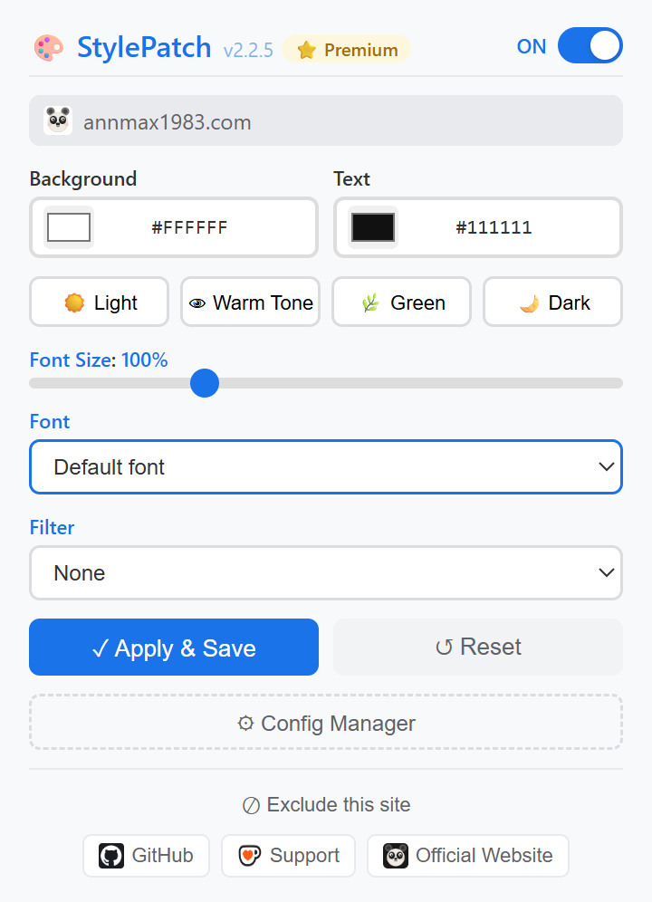

# StylePatch

Official User Manual · Multi-language: [English](README.md) | [中文](languages/README_zh.md) | [Español](languages/README_es.md) | [Deutsch](languages/README_de.md) | [日本語](languages/README_ja.md) | [Français](languages/README_fr.md)

> This document is the official user manual for StylePatch, accessible via the "User Manual" button inside the extension panel.

A lightweight browser extension that lets you customize any webpage's background color, text color, link color, and font size instantly for a more comfortable reading experience.

✅ Officially released on Chrome & Edge Web Store · ✅ Zero tracking, all data stored locally · ✅ Per-site independent settings

---

## Feature List

| Feature | Description |
|---------|-------------|
| 🎨 **Background, Text & Link Color** | Pick any color via native color picker or type hex code directly; link color auto-adjusts for readability |
| 🔠 **Font Size Scaling** | Adjust from 80% to 150% using CSS zoom |
| 👁️ **Preset Themes** | Light, Warm Tone, Green, Dark — one click to apply |
| 🔄 **Global Toggle** | Enable/disable the extension globally without losing settings |
| 🚫 **Site Blacklist** | Exclude specific websites from styling |
| 💾 **Per-Site Settings** | Save different styles for different websites, auto-restore on revisit |
| ⚡ **Real-Time Preview** | All changes apply instantly as you drag, no page reload needed |
| 🌍 **Multi-Language UI** | Supports English, Chinese, Spanish, German, Japanese, French |
| 🔒 **Minimal Permissions** | Only `storage` + `host_permissions` — no unnecessary access |
| 🏗️ **Manifest V3** | Built on Manifest V3 service worker architecture |
| ⭐ **Import & Export Configurations** | Full backup of all site styles, cross-device migration. Available via Config Manager inside the extension. |

---

## Preview

  

---

## Supported Browsers

| Browser | Status | Minimum Version |
|---------|--------|-----------------|
| Google Chrome | ✅ Fully supported | Chrome 88+ |
| Microsoft Edge | ✅ Fully supported | Edge 88+ |
| Other Chromium-based browsers | ✅ Basic compatible | Install via official extension store only |

---

## Installation

For your safety, only install StylePatch through official browser extension stores:

1. Open **Chrome Web Store** or **Microsoft Edge Add-ons**
2. Search: `StylePatch`
3. Click **"Add to Chrome"** / **"Add to Edge"**
4. Click the StylePatch icon in your toolbar to start

> ⚠️ Do not install from third-party websites. Unauthorized versions may compromise your data security.

---

## Usage

1. Click the **StylePatch icon** in your browser toolbar
2. **Pick colors** — Use the native color picker or type a hex code
3. **Choose a preset** — Light, Warm Tone, Green, or Dark
4. **Adjust font size** — Drag the slider from 80% to 150%
5. **Save** — Click **Apply & Save** to persist settings for this site
6. **Reset** — Click ↺ to restore the site's default appearance
7. **Exclude** — Click "Exclude this site" to blacklist a domain
8. **Toggle** — Use the ON/OFF switch to disable without losing settings

### Config Manager

Click **⚙ Config Manager** at the bottom of the popup to open the configuration page:

- **View** all configured sites with their color and font settings
- **Export** all configurations as a JSON backup file
- **Import** a backup file to restore settings on another device or after reinstalling
- **Delete** individual site configurations

---

## FAQ

1. **Styles don't take effect after adjustment?**
   Close other similar extensions (dark mode / eye-care) that may conflict, then refresh the page.

2. **Saved settings disappear after reopening the browser?**
   Make sure you clicked "Apply & Save". If using incognito mode, enable StylePatch permission for private windows.

3. **How do I transfer my settings to a new device?**
   Open Config Manager (⚙), click Export to download a backup file, then Import it on the new device.

4. **Can't find StylePatch on the extension store?**
   Check your network region. You can find the official store link at [www.annmax1983.com](https://www.annmax1983.com).

---

## Privacy

StylePatch follows privacy-by-design principles and collects zero user data:

1. **Permissions requested** — only two:
   - `storage`: Saves your custom colors, font size, site blacklist and theme preferences locally. No webpage content is stored.
   - `host_permissions`: Only used to inject custom CSS styles to adjust page appearance. Does not read DOM text, images, cookies, login credentials or form data.

2. **No tracking** — No browsing history access, no embedded third-party trackers, no automatic external data transmission.

3. **Data stays local** — All configuration data exists only on your device. Data leaves your browser only when you manually export a backup file.

- [Full Privacy Policy](https://annmax1983.github.io/StylePatch/privacy-policy.html)
- [Supplementary Privacy Details](https://www.annmax1983.com)

---

## Copyright Disclaimer

1. This extension only locally adjusts the visual rendering style of web pages for comfortable reading. All text, images and content copyright of each website belong to its respective publisher.
2. Modifying page display styles does not grant users any copyright authorization of website content. Users are strictly prohibited from using this extension to bypass website paywalls, membership restrictions, or anti-copy protection mechanisms.
3. Users shall comply with local laws and platform terms of service when using this extension. Any illegal use shall be borne by the user.

---

## License

Copyright © 2026 StylePatch. All rights reserved.

This software is closed-source proprietary software. Without official written authorization, the following are strictly prohibited:
- Decompiling, cracking, or modifying the program code
- Repackaging, redistribution, sharing, or commercial resale
- Embedding the program into other software for bundled distribution

Violators will bear corresponding legal liabilities.

---

## ❤️ Support

If you find StylePatch helpful, consider buying the developer a coffee!

**[👉 Click here to support](https://ko-fi.com/annmax?buyACoffee=true&ref=stylepatch)**
