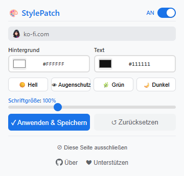

# StylePatch

[English](README.md) | [中文](README_zh.md) | [Español](README_es.md) | [Deutsch](README_de.md) | [日本語](README_ja.md) | [Français](README_fr.md)

Leichte Browser-Erweiterung, mit der du Hintergrundfarbe, Textfarbe und Schriftgröße jeder Webseite sofort anpassen kannst.

> Chromium-basiert · Manifest V3 · Kein Tracking · Einstellungen pro Webseite speicherbar

## Funktionen

| Funktion | Beschreibung |
|----------|--------------|
| 🎨 Hintergrund- und Textfarbe | Farben über den integrierten Farbwähler wählen oder Hex-Code eingeben |
| 🔠 Schriftgrößen-Skalierung | Skalierung von 80% bis 150%, nutzt CSS Zoom |
| 👁️ Voreingestellte Themes | Hell, Augenschutz, Grün, Dunkel — ein Klick zum Anwenden |
| 🔄 Globaler Schalter | Erweiterung global aktivieren/deaktivieren, ohne Einstellungen zu verlieren |
| 🚫 Webseiten-Blacklist | Bestimmte Webseiten vom Styling ausschließen |
| 💾 Webseiten-spezifische Einstellungen | Speichere individuelle Designs für jede Seite, automatisch wiederhergestellt |
| ⚡ Echtzeit-Vorschau | Alle Änderungen wirken sofort, keine Seitenaktualisierung nötig |
| 🌍 Mehrsprachig | Unterstützt Deutsch, Englisch, Spanisch, Japanisch, Französisch, Chinesisch |
| 🔒 Minimale Berechtigungen | Nur `storage` + `host_permissions` — keine unnötigen Zugriffe |
| 🏗️ Manifest V3 | Nutzt `chrome.scripting.insertCSS` — kein Content-Script-Overhead |

## Vorschau

  

## Unterstützte Browser

| Browser | Status |
|---------|--------|
| Google Chrome | ✅ Vollständig unterstützt |
| Microsoft Edge | ✅ Vollständig unterstützt |
| Andere Chromium-Browser | ✅ Funktionsfähig |

## Installation

1. Öffne die Erweiterungsseite deines Browsers:
   - Chrome: `chrome://extensions/`
   - Edge: `edge://extensions/`
2. Schalte oben rechts den **Entwicklermodus** ein
3. Klicke auf **Entpackte Erweiterung laden** und wähle den Projektordner aus
4. Klicke auf das StylePatch-Symbol in der Werkzeugleiste zum Starten

## Nutzung

1. Klicke auf das StylePatch-Symbol in der Browser-Werkzeugleiste
2. Farben auswählen: Nutze den Farbwähler oder gib einen Hex-Code ein
3. Wähle ein Voreinstellung: Hell, Augenschutz, Grün oder Dunkel
4. Schriftgröße anpassen: Ziehe den Regler zwischen 80% und 150%
5. Speichern: Klicke auf **Übernehmen & Speichern**, um Einstellungen für die Seite zu sichern
6. Zurücksetzen: Klicke auf ↺, um das Originaldesign der Webseite wiederherzustellen
7. Ausschließen: Klicke auf „Diese Seite ausschließen", um eine Domain zu blockieren
8. Globaler Schalter: Nutze den AN/AUS-Schalter, um temporär zu deaktivieren

## Datenschutz

- Nur `storage` + `host_permissions` Berechtigungen — nichts weiter
- Kein Zugriff auf Browserverlauf, keine Nutzerverfolgung, keine Datenübertragung nach außen
- Alle Einstellungen bleiben lokal im Browser gespeichert

## Lizenz

Copyright © 2026 StylePatch. Alle Rechte vorbehalten.

---

## ❤️ Unterstütze den Entwickler

Wenn dir StylePatch gefällt, spendier mir einen Kaffee!

**[👉 Hier klicken zum Unterstützen](https://ko-fi.com/annmax?buyACoffee=true&ref=stylepatch)**
