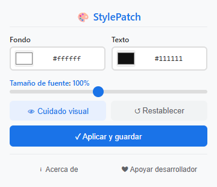

# StylePatch
Extensión ligera para navegador. Modifica instantáneamente el color de fondo, el color del texto y el tamaño de fuente de cualquier página web.
> Compatible con navegadores Chromium · Manifest V3 · Sin seguimiento · Configuración independiente por sitio

## Características
| Función | Descripción |
|---------|-------------|
| 🎨 Color de fondo y texto | Elige colores con el selector nativo o escribe códigos hexadecimales |
| 🔠 Ajuste de tamaño de fuente | Escala entre 60% y 150%, válido para fuentes en píxeles fijos |
| 👁️ Modo protección ocular | Un clic para activar tonos cálidos, ideal para leer sin cansancio |
| 💾 Configuración por sitio | Guarda estilos distintos para cada web, se restauran al volver |
| ⚡ Vista previa en tiempo real | Los cambios se aplican al instante, no hace falta recargar la página |
| 🔄 Soporte para contenido dinámico | Modifica automáticamente SPA y elementos cargados tarde |
| 🌍 Varios idiomas | Disponible en español, inglés, alemán, japonés, francés, chino |
| 🔒 Permisos mínimos | Solo requiere `activeTab` y `storage`, sin accesos innecesarios |

## Vista previa

  

## Navegadores compatibles
| Navegador | Estado |
|-----------|--------|
| Google Chrome | ✅ Totalmente compatible |
| Microsoft Edge | ✅ Totalmente compatible |
| Otros navegadores Chromium | ✅ Funciona sin problemas |

## Instalación
1. Abre la página de extensiones de tu navegador:
   - Chrome: `chrome://extensions/`
   - Edge: `edge://extensions/`
2. Activa el **Modo desarrollador** (interruptor arriba a la derecha)
3. Pulsa **Cargar extensión descomprimida** y selecciona la carpeta del proyecto
4. Haz clic en el icono de StylePatch en la barra de herramientas para empezar

## Modo de uso
1. Haz clic en el icono de StylePatch de la barra de herramientas
2. Selecciona colores: usa el selector o escribe el código hexadecimal
3. Ajusta el tamaño de fuente: mueve el control deslizante entre 60% y 150%
4. Modo protección ocular: pulsa el icono 👁 para un tema cálido y cómodo
5. Guardar: pulsa **Aplicar y guardar** para conservar los estilos de este sitio
6. Restablecer: pulsa ↺ para volver al aspecto original de la web

Los ajustes se guardan automáticamente al cerrar la ventana y se recuperan al visitar el sitio de nuevo.

## Privacidad
- Solo pide permisos `activeTab` y `storage`, nada más
- No accede a tu historial, no te rastrea ni envía datos externos
- Todos tus ajustes se guardan solo en tu navegador local

## Licencia
Copyright © 2026 StylePatch. Todos los derechos reservados.

> Nota: Este repositorio es solo para mostrar el proyecto. No incluye código completo, manifesto, iconos ni scripts de compilación. El código fuente completo no se publicará aquí.
