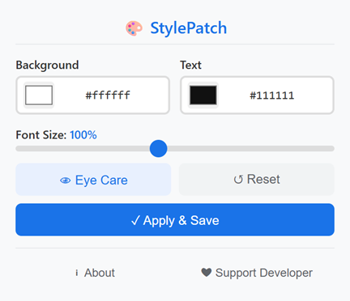

# StylePatch

[English](README.md) | [中文](README_zh.md) | [Español](README_es.md) | [Deutsch](README_de.md) | [日本語](README_ja.md) | [Français](README_fr.md)

Extension de navigateur légère qui permet de modifier instantanément la couleur de fond, la couleur du texte et la taille de police de n’importe quelle page web.
> Basé sur Chromium · Manifest V3 · Aucun suivi · Paramètres séparés par site

## Fonctionnalités
| Fonction | Description |
|----------|-------------|
| 🎨 Couleur fond et texte | Choisissez une couleur via le sélecteur natif ou entrez un code hexadécimal |
| 🔠 Redimensionnement de police | Réglable de 60 % à 150 %, compatible avec les tailles en pixels fixes |
| 👁️ Mode protection des yeux | Un clic pour un thème chaud plus confortable à la lecture |
| 💾 Paramètres par site | Enregistrez des styles différents pour chaque site, restaurés automatiquement |
| ⚡ Aperçu en temps réel | Les changements s’appliquent immédiatement, sans recharger la page |
| 🔄 Contenu dynamique | Adapte automatiquement les SPA et contenus chargés en différé |
| 🌍 Multilingue | Prend en charge le français, l’anglais, l’espagnol, l’allemand, le japonais, le chinois |
| 🔒 Permissions minimales | Seulement `activeTab` et `storage`, pas d’accès superflu |

## Aperçu

  

## Navigateurs compatibles
| Navigateur | État |
|------------|------|
| Google Chrome | ✅ Entièrement compatible |
| Microsoft Edge | ✅ Entièrement compatible |
| Autres navigateurs Chromium | ✅ Fonctionnel |

## Installation
1. Ouvrez la page des extensions de votre navigateur :
   - Chrome : `chrome://extensions/`
   - Edge : `edge://extensions/`
2. Activez le **Mode développeur** (interrupteur en haut à droite)
3. Cliquez sur **Charger l’extension non empaquetée** et sélectionnez le dossier du projet
4. Cliquez sur l’icône StylePatch dans la barre d’outils pour commencer

## Utilisation
1. Cliquez sur l’icône StylePatch dans la barre d’outils du navigateur
2. Choisissez vos couleurs : utilisez le sélecteur ou saisissez un code hex
3. Ajustez la taille de police : faites glisser le curseur entre 60 % et 150 %
4. Mode protection des yeux : cliquez sur 👁 pour un thème chaud adapté à la lecture
5. Enregistrer : cliquez sur **Appliquer et enregistrer** pour conserver le style du site
6. Réinitialiser : cliquez sur ↺ pour retrouver l’apparence originale du site

Les paramètres s’enregistrent automatiquement à la fermeture de la fenêtre et se restaurent à chaque visite du même site.

## Confidentialité
- Ne demande que les permissions `activeTab` et `storage`, rien d’autre
- Pas d’accès à votre historique, pas de suivi utilisateur, aucun transfert de données externe
- Tous vos paramètres restent stockés localement dans votre navigateur

## Licence
Copyright © 2026 StylePatch. Tous droits réservés.

> Note : Ce dépôt est uniquement destiné à la présentation du projet. Il ne contient pas le code source complet, le manifeste, les icônes ni les scripts de compilation. Le code source complet ne sera pas publié ici.

---

## ❤️ Soutenir le développeur

Si StylePatch vous est utile, offrez-moi un café !

**[👉 Cliquez ici pour soutenir](https://www.creem.io/payment/prod_4LTHdgvsMSURUjevX47qHE)**
