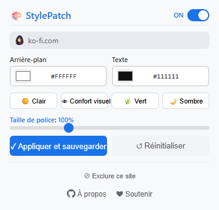

# StylePatch

[English](README.md) | [中文](README_zh.md) | [Español](README_es.md) | [Deutsch](README_de.md) | [日本語](README_ja.md) | [Français](README_fr.md)

Extension de navigateur légère qui permet de modifier instantanément la couleur de fond, la couleur du texte et la taille de police de n'importe quelle page web.

> Basé sur Chromium · Manifest V3 · Aucun suivi · Paramètres par site

## Fonctionnalités

| Fonction | Description |
|----------|-------------|
| 🎨 Couleur fond et texte | Choisissez une couleur via le sélecteur natif ou entrez un code hexadécimal |
| 🔠 Redimensionnement de police | Réglable de 80 % à 150 %, utilise CSS zoom |
| 👁️ Thèmes prédéfinis | Clair, Ton Chaud, Vert, Sombre — un clic pour appliquer |
| 🔄 Interrupteur global | Activez/désactivez l'extension sans perdre les paramètres sauvegardés |
| 🚫 Liste noire de sites | Excluez des sites web spécifiques du stylage |
| 💾 Paramètres par site | Enregistrez des styles différents pour chaque site, restaurés automatiquement |
| ⚡ Aperçu en temps réel | Les changements s'appliquent immédiatement, sans recharger la page |
| 🌍 Multilingue | Prend en charge le français, l'anglais, l'espagnol, l'allemand, le japonais, le chinois |
| 🔒 Permissions minimales | Seulement `storage` + `host_permissions`, pas d'accès superflu |
| 🏗️ Manifest V3 | Utilise `chrome.scripting.insertCSS` — aucun overhead de content script |

## Aperçu

  

## Navigateurs compatibles

| Navigateur | État |
|------------|------|
| Google Chrome | ✅ Entièrement compatible |
| Microsoft Edge | ✅ Entièrement compatible |
| Autres navigateurs Chromium | ✅ Fonctionnel |

## Installation

1. Ouvrez la page des extensions de votre navigateur :
   - Chrome : `chrome://extensions/`
   - Edge : `edge://extensions/`
2. Activez le **Mode développeur** (interrupteur en haut à droite)
3. Cliquez sur **Charger l'extension non empaquetée** et sélectionnez le dossier du projet
4. Cliquez sur l'icône StylePatch dans la barre d'outils pour commencer

## Utilisation

1. Cliquez sur l'icône StylePatch dans la barre d'outils du navigateur
2. Choisissez vos couleurs : utilisez le sélecteur ou saisissez un code hex
3. Choisissez un préréglage : Clair, Ton Chaud, Vert ou Sombre
4. Ajustez la taille de police : faites glisser le curseur entre 80 % et 150 %
5. Enregistrer : cliquez sur **Appliquer et enregistrer** pour conserver le style du site
6. Réinitialiser : cliquez sur ↺ pour retrouver l'apparence originale du site
7. Exclure : cliquez sur « Exclure ce site » pour bloquer un domaine
8. Interrupteur global : utilisez le commutateur ON/OFF pour désactiver temporairement

## Confidentialité

- Ne demande que les permissions `storage` + `host_permissions`, rien d'autre
- Pas d'accès à votre historique, pas de suivi utilisateur, aucun transfert de données externe
- Tous vos paramètres restent stockés localement dans votre navigateur

## Licence

Copyright © 2026 StylePatch. Tous droits réservés.

---

## ❤️ Soutenir le développeur

Si StylePatch vous est utile, offrez-moi un café !

**[👉 Cliquez ici pour soutenir](https://ko-fi.com/annmax?buyACoffee=true&ref=stylepatch)**
