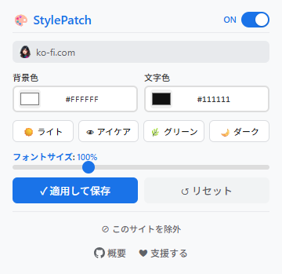

# StylePatch

[English](README.md) | [中文](README_zh.md) | [Español](README_es.md) | [Deutsch](README_de.md) | [日本語](README_ja.md) | [Français](README_fr.md)

軽量ブラウザ拡張機能。任意のウェブページの背景色・文字色・フォントサイズを瞬時に変更できます。

> Chromium系対応 · Manifest V3 · 追跡なし · サイトごとに設定保存可能

## 機能一覧

| 機能 | 説明 |
|------|------|
| 🎨 背景色・文字色変更 | 標準カラーピッカーで色を選ぶ、またはHEXコードを直接入力 |
| 🔠 フォントサイズ拡縮 | 80%～150%の範囲で調整、CSS zoomを使用 |
| 👁️ プリセットテーマ | ライト・アイケア・グリーン・ダーク — ワンクリックで適用 |
| 🔄 グローバルトグル | 拡張機能をグローバルにON/OFF、設定は保持 |
| 🚫 サイトブラックリスト | 特定のウェブサイトをスタイリングから除外 |
| 💾 サイト別設定保存 | サイトごとに異なるスタイルを保存、再訪時に自動復元 |
| ⚡ リアルタイム反映 | スライダー操作で即時反映、ページ再読み込み不要 |
| 🌍 多言語対応 | 日本語、英語、スペイン語、ドイツ語、フランス語、中国語に対応 |
| 🔒 最小限の権限 | `storage` + `host_permissions` のみ使用、不要なアクセスなし |
| 🏗️ Manifest V3 | `chrome.scripting.insertCSS` を使用 — content script オーバーヘッドなし |

## プレビュー

  

## 対応ブラウザ

| ブラウザ | 動作状況 |
|----------|----------|
| Google Chrome | ✅ 完全対応 |
| Microsoft Edge | ✅ 完全対応 |
| その他Chromium系ブラウザ | ✅ 正常動作 |

## インストール方法

1. ブラウザの拡張機能ページを開く
   - Chrome：`chrome://extensions/`
   - Edge：`edge://extensions/`
2. 右上の「デベロッパーモード」をオンにする
3. 「パッケージ化されていない拡張機能を読み込む」をクリックし、プロジェクトフォルダを選択
4. ツールバーのStylePatchアイコンをクリックして利用開始

## 使用方法

1. ブラウザツールバーのStylePatchアイコンをクリック
2. 色設定：カラーピッカーを使うか、HEXコードを入力
3. プリセットを選択：ライト、アイケア、グリーン、ダーク
4. フォントサイズ調整：スライダーを80%～150%の間で操作
5. 保存：「適用して保存」をクリックすると、現在のサイト用スタイルが保存される
6. リセット：↺ボタンでサイト標準の表示に戻す
7. 除外：「このサイトを除外」をクリックしてドメインを除外
8. グローバルトグル：ON/OFFスイッチで一時的に無効化

## プライバシーについて

- 使用権限は `storage` + `host_permissions` のみ
- 閲覧履歴を取得せず、ユーザー追跡・外部へのデータ送信も一切行わない
- すべての設定データはローカルのブラウザ内に保管

## ライセンス

Copyright © 2026 StylePatch 全著作権所有

---

## ❤️ 開発者を支援する

StylePatchが役に立ったら、コーヒーをおごっていただけると嬉しいです！

**[👉 こちらをクリックして支援](https://ko-fi.com/annmax?buyACoffee=true&ref=stylepatch)**
