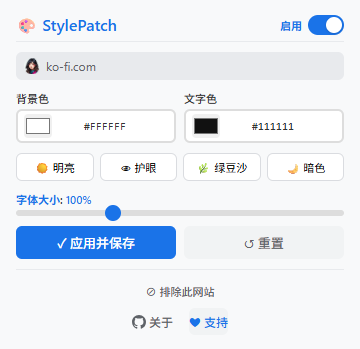

# StylePatch

[English](README.md) | [中文](README_zh.md) | [Español](README_es.md) | [Deutsch](README_de.md) | [日本語](README_ja.md) | [Français](README_fr.md)

轻量浏览器插件，一键自定义任意网页背景色、文字颜色与字体大小
> 基于Chromium内核 · Manifest V3规范 · 无数据追踪 · 分网站独立配置

## 功能一览
| 功能 | 说明 |
|------|------|
| 🎨 自定义背景&文字颜色 | 内置取色器选色，也可直接输入十六进制色值 |
| 🔠 字体缩放调节 | 缩放范围60%–150%，适配固定像素字号网页 |
| 👁️ 护眼模式 | 一键切换暖色调，长时间阅读更舒适 |
| 💾 分网站保存配置 | 不同网站可保存专属样式，再次访问自动生效 |
| ⚡ 实时预览效果 | 拖动调节即时生效，无需刷新页面 |
| 🔄 适配动态页面 | 自动美化单页应用、延迟加载等动态加载内容 |
| 🌍 多语言支持 | 支持中文、英语、西班牙语、德语、日语、法语 |
| 🔒 最小权限请求 | 仅申请activeTab和本地存储权限，无多余权限 |

## 效果预览

  

## 支持浏览器
| 浏览器 | 兼容状态 |
|--------|----------|
| Google Chrome | ✅ 完全支持 |
| Microsoft Edge | ✅ 完全支持 |
| 其他Chromium内核浏览器 | ✅ 均可正常使用 |

## 安装步骤
1. 打开浏览器扩展管理页面
   - Chrome：`chrome://extensions/`
   - Edge：`edge://extensions/`
2. 开启右上角「开发者模式」开关
3. 点击「加载已解压的扩展程序」，选中项目文件夹
4. 点击工具栏StylePatch图标即可开始使用

## 使用教程
1. 点击浏览器工具栏上StylePatch图标
2. 设置颜色：使用取色器挑选，或直接输入十六进制色号
3. 调节字体：拖动滑块，缩放区间60%–150%
4. 护眼模式：点击👁图标，切换柔和暖色系阅读主题
5. 保存配置：点击「应用并保存」，当前网站样式永久留存
6. 重置页面：点击↺按钮，恢复网页原始默认样式

弹窗关闭时设置会自动保存，下次打开该网站自动加载你的自定义样式。

## 隐私说明
- 仅使用activeTab（当前标签）与本地存储权限，无额外权限
- 不会读取浏览记录、不追踪用户行为、不上传任何数据至外网
- 所有配置数据仅保存在本地浏览器，不会外泄

## 版权许可
Copyright © 2026 StylePatch 保留所有权利

> 提示：本仓库仅用于项目展示，不含完整源码、配置清单、图标与编译脚本。完整源代码不会对外公开。

---

## ❤️ 支持作者

如果 StylePatch 对你有帮助，请作者喝杯咖啡吧！

**[👉 点击这里支持](https://www.creem.io/payment/prod_4LTHdgvsMSURUjevX47qHE)**
